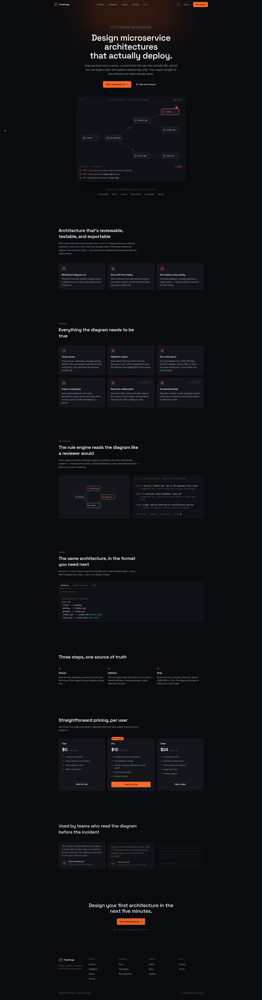
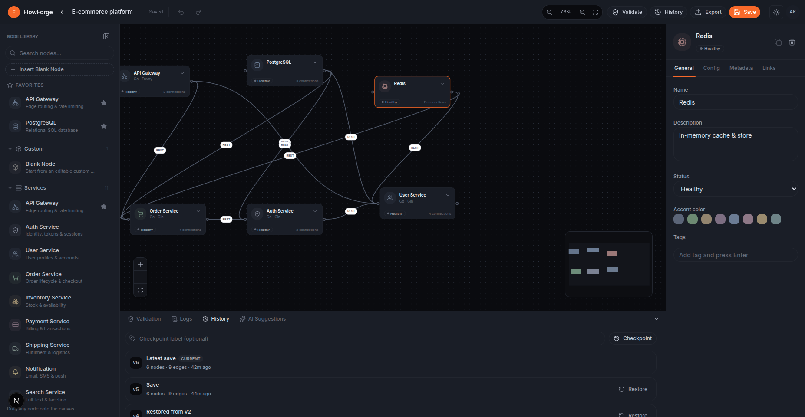
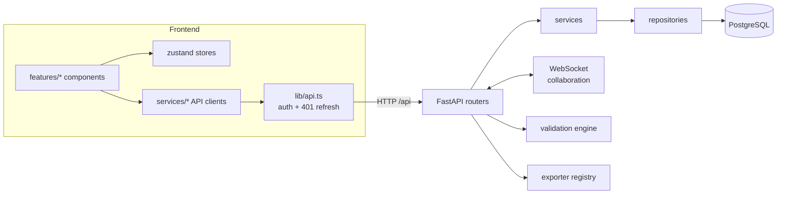

# FlowForge

**Visual Microservice Architecture Designer** — a production-quality SaaS for
designing, validating, and exporting microservice architectures.


## Screenshots

<table>
  <tr>
    <td width="50%" valign="top">
      <p><strong>Landing page</strong></p>
      <div style="max-height: 480px; overflow-y: auto; border: 1px solid #30363d; border-radius: 8px;">
        
      </div>
    </td>
    <td width="50%" valign="top">
      <p><strong>Architecture designer</strong></p>
      
    </td>
  </tr>
</table>

## Overview

FlowForge is a two-part application:

| Layer    | Stack                                                                                                                                                              |
| -------- | ------------------------------------------------------------------------------------------------------------------------------------------------------------------ |
| Frontend | Next.js 16 (App Router) · React 19 · TypeScript · TailwindCSS 4 · Framer Motion · React Flow · dnd-kit · Zustand · React Hook Form · Zod · TanStack Query · Lucide |
| Backend  | Python 3.13 · FastAPI · SQLAlchemy 2.0 (async) · Alembic · PostgreSQL · Redis · Pydantic v2 · JWT · WebSockets                                                     |

Both sides follow **Clean Architecture**: `API → Service → Repository → DB`,
with dependency injection, SOLID boundaries, and **no business logic in UI
components or route handlers**. The frontend is organized feature-first under
`frontend/src/features/`; shared stores, services, and types live in
`frontend/src/store|services|types`.

Extensible by design:

- **Validation engine** — rule-based checks with per-issue
  `severity / message / description / suggestion / affectedNodes`.
- **Exporter interface** — pluggable formats (JSON, Mermaid, Docker Compose,
  draw.io, PNG, SVG).
- **Prepared interfaces** for AI-assisted design, simulation, Terraform /
  Kubernetes manifests, and collaborative editing.

## Architecture



## Repository layout

```
├── backend/            FastAPI service (app/, migrations/, tests/)
├── frontend/           Next.js app (src/app, src/features, src/store, ...)
├── docker-compose.yml  PostgreSQL + Redis for local infra
├── Makefile            Common dev commands (uv or pip venv)
└── .env.example        Backend environment template
```

## Prerequisites

- **Python 3.13+**
- **Node.js 20+** (Next.js 16 requirement)
- **Docker** (for PostgreSQL + Redis — _optional_, see the SQLite fallback below)
- **uv** (_optional_ — the Makefile falls back to a plain `backend/venv`)

## Quick start

```bash
# 1. Infrastructure (PostgreSQL + Redis)
make infra-up            # docker compose up -d postgres redis

# 2. Backend
make backend-install     # uv sync  OR  pip venv + pip install -e ".[dev]"
make backend-migrate     # alembic upgrade head
make backend-dev         # uvicorn on :8000

# 3. Frontend
make frontend-install    # npm install
make frontend-dev        # next dev on :3000
```

Open http://localhost:3000, register an account, and create your first
architecture.

### Environment variables

Copy `.env.example` to `backend/.env` and adjust (especially `SECRET_KEY` in
production). The frontend reads `NEXT_PUBLIC_API_URL`, defaulting to
`http://localhost:8000/api`.

## Development without Docker (SQLite fallback)

If Docker is unavailable (e.g. `docker info` fails), run the backend against a
local SQLite file — the migrations are written portably so they work on both
PostgreSQL and SQLite:

```bash
cd backend
DATABASE_URL="sqlite+aiosqlite:///./flowforge.db" venv/bin/python -m alembic upgrade head
DATABASE_URL="sqlite+aiosqlite:///./flowforge.db" venv/bin/python -m uvicorn app.main:app --reload --port 8000
```

> ⚠️ The migration file uses `CURRENT_TIMESTAMP` (not Postgres-only `now()`) so
> SQLite and PostgreSQL behave identically.

## Testing & linting

```bash
make backend-check      # ruff check + pytest (in-memory SQLite, 41 tests)
make typecheck          # npx tsc --noEmit
make build              # next build
```

## API surface (v1, prefix `/api`)

| Method | Path                        | Description                                      |
| ------ | --------------------------- | ------------------------------------------------ |
| POST   | `/auth/register`            | Register (201, token pair)                       |
| POST   | `/auth/login`               | Login (token pair)                               |
| POST   | `/auth/refresh`             | Rotate refresh token (revokes the old)           |
| POST   | `/auth/logout`              | Revoke refresh token (204)                       |
| GET    | `/auth/me`                  | Current user                                     |
| GET    | `/projects`                 | List project summaries                           |
| POST   | `/projects`                 | Create project (201)                             |
| GET    | `/projects/{id}`            | Project incl. graph                              |
| PUT    | `/projects/{id}`            | Rename / update                                  |
| PUT    | `/projects/{id}/graph`      | Persist graph                                    |
| DELETE | `/projects/{id}`            | Archive / delete (204)                           |
| POST   | `/validation`               | Validate a graph (optional auth)                 |
| POST   | `/validation/projects/{id}` | Validate a saved project                         |
| POST   | `/export?format=X`          | Export (json\|mermaid\|docker\|drawio\|png\|svg) |

Auth is `Bearer` JWT: access tokens expire in 15 min, refresh tokens in 30 days
with **rotation + revocation** (SHA-256 hash stored server-side; each refresh
invalidates the previous refresh token).

## Troubleshooting

- **Dev server unreachable from the browser after `npm run dev`** — if the
  terminal runs sandboxed, sockets are isolated from the host network. Run the
  dev server with network access enabled (or outside the sandbox).
- **`next-panic` / "Next.js package not found"** — the `.next` dev cache got
  corrupted (e.g. after force-killing the server). `rm -rf frontend/.next` and
  restart.
- **`sqlite3.OperationalError: unknown function: now()`** — you are running a
  Postgres-only migration against SQLite; see the SQLite fallback section.
- **Refresh-token thrash** — token rotation means a second tab that retries a
  stale refresh can invalidate your session. Use one active tab during dev.

```

```
